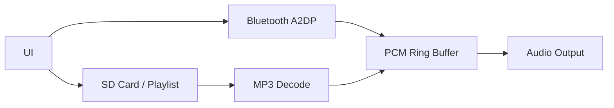

## High-level architecture

### Source map
- `main/bt_a2dp.*` – Bluetooth A2DP handling
- `main/mp3_decode.*` – MP3 decode
- `main/ring_pcm.*` – PCM ring buffer
- `main/sd_mount.*` + `main/playlist.*` – SD + playlist
- `main/ui.*` – UI layer
- `main/pin_config.h` – pin definitions
